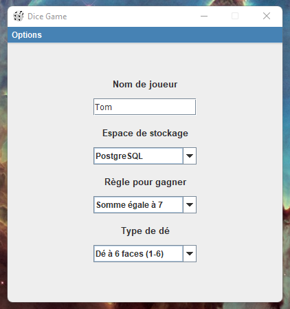
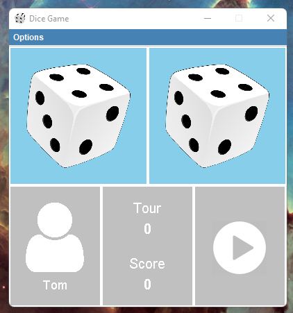
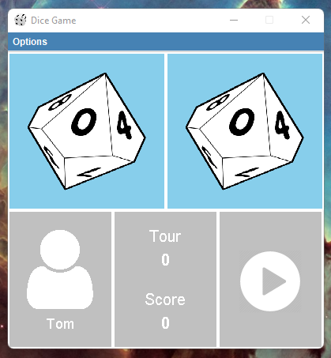
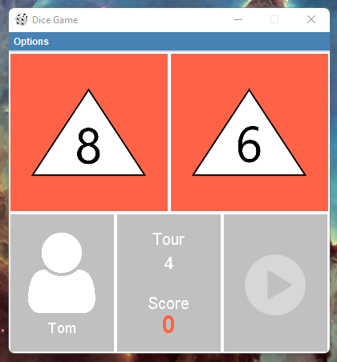
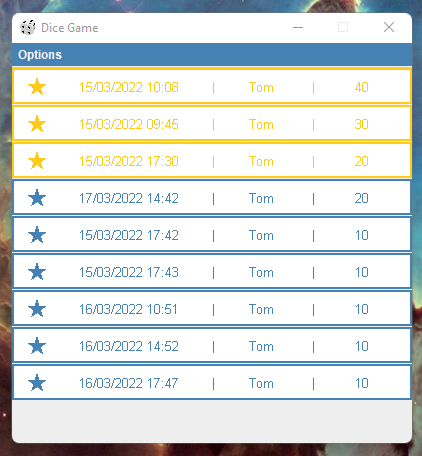

# Application
Dice Game

### Description
Jeu de dé en client lourd.
Le joueur fait 10 lancers de 2 dés.
Il peut paramétrer les règles, du jeu et les type des dés.

### Langages, librairies, frameworks
- Java 17
- Maven
- Drivers SQL : PosgtreSQL, MySQL, H2

### Auteurs
- ARNOULD Maxime
- CHEVRIER Jean-Christophe

### Installation et exécution
     mvn package && java -jar .\target\dice-game-1.0-SNAPSHOT.jar
