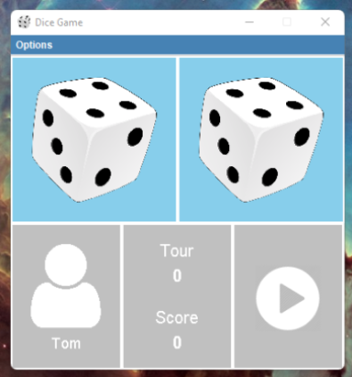
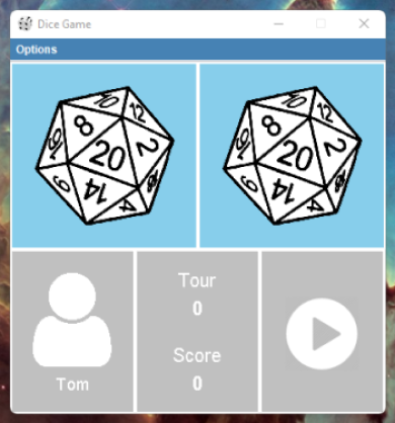
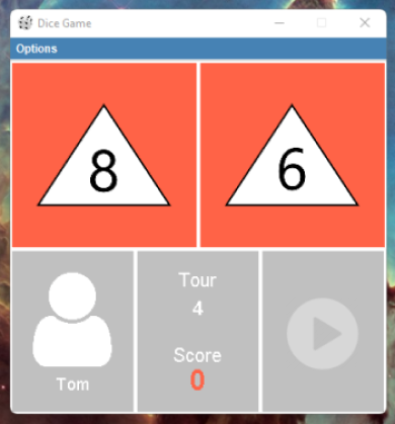

# Application
Dice Game

### Description
Jeu de dé en client lourd.
 
 
Le joueur fait 10 lancers de 2 dés à 6 faces, et s'il obtient
7 à un lancer, comme somme des faces des dés, il gagne 10 points
(paramètres par défaut).
 
 
Le joueur peut :
- jouer des parties ;
- consulter ses 10 meilleurs scores ;
- paramétrer son nom, son espace de stockage, les règles du jeu, et les types des dés.

### Langages, librairies, frameworks
- `Java 17`
- `Maven`
- `Java AWT`
- `Java Swing`
- `PostgreSQL`
- `MySQL`
- `H2`

### Auteurs
- ARNOULD Maxime
- CHEVRIER Jean-Christophe

### Installation et exécution
1. Démarrez vos serveurs de base de données `PostgreSQL`, `MySQL`, `H2`,
et déclarez pour chaque une base de données avec le nom que vous préférez (exemple: `dice_game`), 
et une table `Score` dedans, dont le code de déclaration est présent à ce chemin pour chaque base de données : 
`src/main/SQL/ul/idmc/m2/miage/sid/dice_game/initialization/`.
2. Dans `src/main/RESOURCES/ul/idmc/m2/miage/sid/dice_game/configuration/`,
déclarez dans les fichiers présents la configuration de chaque espace de stockage, dont parmi les 3 bases de 
données.
3. Compilez et exécutez le jeu. Pour faire cela, rendez-vous dans le répertoire home du projet sur un terminal, et exécuter ceci :
   `mvn package && java -jar .\target\dice-game-1.0-SNAPSHOT.jar`

### Images du jeu

Voici quelques images du jeu :
 

